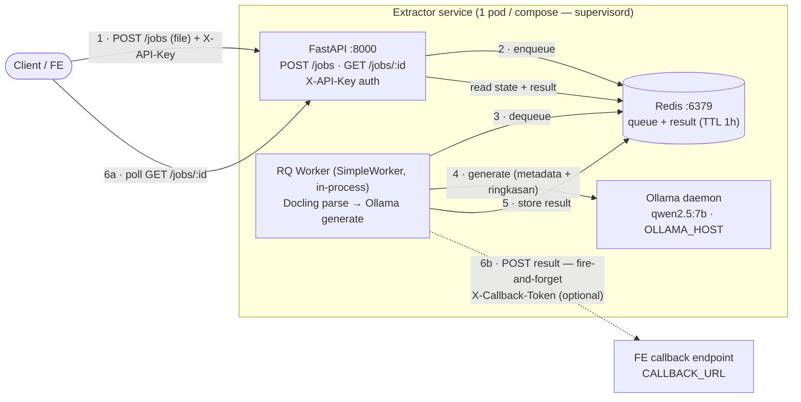

# Srikandi Naskah Extractor — PoC

FastAPI + RQ + Redis service untuk ekstraksi struktur (hal, nomor_naskah, tanggal, suggest_ringkasan) dari DOCX/PDF naskah dinas, didukung Ollama LLM lokal.

Model default: `qwen2.5:7b-instruct-q4_K_M` (terpilih dari benchmark — accuracy 85.2%, 100% JSON valid, VRAM 7 GB).

## Arsitektur



> Catatan: `OLLAMA_HOST` menunjuk daemon Ollama. Di deploy GPU (RunPod) ia co-located
> di dalam pod (supervisord); di dev MacBook ia jalan native di host (`host.docker.internal`
> bila API/worker di container). Callback (6b) opsional — aktif bila `CALLBACK_URL` diset.

## Cara Run

### Opsi A: docker compose (recommended — match prod pattern)

Prerequisite: Ollama jalan di MacBook + model `qwen2.5:7b-instruct-q4_K_M` sudah di-pull (`ollama pull qwen2.5:7b-instruct-q4_K_M`).

```bash
cd poc-2026/extractor-app
docker compose up --build
# Buka http://localhost:8000
```

Stop: `Ctrl+C` lalu `docker compose down` (tambah `-v` untuk hapus volume data).

Scale worker: `docker compose up --scale worker=2 --build`

### Opsi A2: docker compose + GPU (Linux host only)

Untuk deploy di GPU host (mis. tensordock VM Linux), worker pakai PyTorch+CUDA base image biar Docling auto-pakai GPU untuk layout/OCR. ~5-10× speedup untuk PDF image-heavy.

```bash
docker compose -f docker-compose.yml -f docker-compose.gpu.yml up --build
```

Prerequisite host:
- NVIDIA driver terinstall (`nvidia-smi` works)
- `nvidia-container-toolkit` terinstall ([install guide](https://docs.nvidia.com/datacenter/cloud-native/container-toolkit/install-guide.html))
- Ollama jalan native di host (`OLLAMA_HOST=0.0.0.0:11434 ollama serve` supaya listen all interfaces, bukan cuma 127.0.0.1)

**MacBook**: override GPU **TIDAK akan kerja** — Docker Desktop / OrbStack tidak expose Metal ke container. Pakai Opsi A (CPU container) atau Opsi B (native worker = Metal access).

### Opsi B: native local (uv + Redis brew)

```bash
# 1. Redis lokal (sekali setup)
brew install redis
brew services start redis

# 2. Project venv + deps
cd poc-2026/extractor-app
uv sync

# 3. Run worker (terminal 1)
uv run python worker.py

# 4. Run API (terminal 2)
uv run uvicorn main:app --reload --port 8000

# 5. Buka http://localhost:8000
```

## API

| Method | Path | Auth | Body | Response |
|---|---|---|---|---|
| POST | `/jobs` | `X-API-Key` | `multipart/form-data` field `file` (.pdf / .docx) | 202 + `{id, status: "queued"}` |
| GET | `/jobs/{id}` | `X-API-Key` | — | 200 + `{id, status, result, error, timing}` |
| GET | `/health` | — (open) | — | 200 + Redis ping + worker count + queue depth |
| GET | `/` | — (open) | — | Demo HTML (drag-drop UI) |

### Auth (API key)

Endpoint job (`POST /jobs`, `GET /jobs/{id}`) dilindungi header `X-API-Key`. Key dibaca
dari env `API_KEY` saat request (`secrets.compare_digest`). **`API_KEY` kosong = auth
MATI** (fail-open) — nyaman untuk dev lokal / demo UI, tapi WAJIB diset sebelum expose
publik. `/health` & `/` sengaja tetap terbuka (healthcheck RunPod/Cloudflare). Demo UI
punya tombol 🔑 untuk menyimpan key di `localStorage`.

### Job status lifecycle

```
queued → started → finished
                 ↘ failed
```

`GET /jobs/{id}` polling — 1s interval recommended. Result expires after `RESULT_TTL_S` (default 3600s = 1h).

### Contoh response (semua endpoint)

**`POST /jobs`** → `202 Accepted` (job baru di-enqueue):

```json
{
  "id": "4b1e9dc1-97ec-4b15-b56d-9c6eeab59a76",
  "status": "queued",
  "created_at": "2026-05-31T02:33:15.646122+00:00",
  "started_at": null,
  "ended_at": null,
  "result": null,
  "error": null
}
```

**`GET /jobs/{id}`** → `200` saat `status: "finished"` (hasil ekstraksi lengkap):

```json
{
  "id": "d08ed1ca-aaa5-4609-bbf2-e9199002296a",
  "status": "finished",
  "created_at": "2026-06-04T01:31:36.156264+00:00",
  "started_at": "2026-06-04T01:31:36.163231+00:00",
  "ended_at": "2026-06-04T01:31:44.746722+00:00",
  "result": {
    "hal": null,
    "nomor_naskah": "000.5.6.2/X /2025",
    "tanggal": "2025-12-15",
    "suggest_ringkasan": "Surat tugas ini menugaskan Plt. Kepala Dinas Arsip dan Perpustakaan Kabupaten Pekalongan untuk melaksanakan penilaian dan verifikasi fisik arsip usul musnah milik eks Bagian Keuangan yang memiliki retensi minimal 10 tahun.",
    "parsed_markdown_preview": "## SURAT TUGAS\n\nNOMOR : 000.5.6.2/X /2025\n\nDasar : Keputusan Bupati ...",
    "docling_elapsed_s": 1.088,
    "metadata_elapsed_s": 4.326,
    "ringkasan_elapsed_s": 1.483,
    "ringkasan_n_llm_calls": 1,
    "metadata_json_valid": true,
    "ringkasan_json_valid": true,
    "model": "qwen2.5:7b-instruct-q4_K_M",
    "strategy": "single-shot",
    "parsed_chars": 2754,
    "warnings": [
      "hal_dropped_no_label: 'Melaksanakan penilaian dan verifikasi fisik arsip usul musnah milik eks Bagian Keuangan yang memiliki retensi sekurang-kurangnya 10 (sepuluh) tahun.'"
    ],
    "original_filename": "SURAT TUGAS PEMUSNAHAN.pdf"
  },
  "error": null
}
```

> Contoh di atas respons nyata (pod GPU, 2026-06-04). Dokumen Surat Tugas tak punya label
> "Hal" — LLM sempat mengarang nilai dari bagian `Untuk :`, lalu di-drop oleh guard
> (`hal: null`) dengan jejak di `warnings` (`hal_dropped_no_label`). Timing: Docling parse
> ~1s di GPU (CPU ~10s); `tanggal` sudah ternormalisasi ISO dari "15 Desember 2025".

**`GET /jobs/{id}`** → `200` saat masih `queued` / `started` (sama seperti POST, `result` & `ended_at` masih `null`; `started_at` terisi begitu worker mulai).

**`GET /jobs/{id}`** → `200` saat `status: "failed"` (exception TAK tertangani — mis. Ollama mati / timeout / OOM):

```json
{
  "id": "9c139434-a74c-4eeb-a734-0fe7f9162409",
  "status": "failed",
  "created_at": "2026-05-31T02:33:24.247982+00:00",
  "started_at": "2026-05-31T02:33:24.253716+00:00",
  "ended_at": "2026-05-31T02:33:25.000000+00:00",
  "result": null,
  "error": "ConnectionError: [Errno 111] Connection refused"
}
```

> ⚠️ **Penting untuk FE — parse gagal ≠ status failed.** Bila Docling gagal mem-parse
> dokumen (PDF korup/rusak), job TETAP `finished` tapi `result.warnings` berisi pesan
> (`"docling_parse_failed: ..."`), semua field metadata `null`, dan
> `metadata_json_valid`/`ringkasan_json_valid` = `false`. Jadi cek **`result.warnings`
> dan `*_json_valid`**, bukan hanya `status`, untuk memastikan ekstraksi benar-benar sukses.

**`GET /health`** → `200` (`status: "degraded"` + HTTP 503 bila Redis down / tak ada worker):

```json
{
  "status": "ok",
  "redis": true,
  "workers_listening": 1,
  "queue_depth": 0,
  "queue": "extractor"
}
```

**Error responses** (semua berbentuk `{"detail": "..."}`):

```jsonc
// 401 — key salah / tak ada (POST /jobs, GET /jobs/{id})
{ "detail": "Invalid or missing API key" }
// 400 — tipe file tak didukung (POST /jobs)
{ "detail": "Unsupported file type '.txt'. Hanya .pdf / .docx didukung." }
// 400 — file kosong (POST /jobs)
{ "detail": "Empty upload" }
// 404 — job tak ada / sudah expired (GET /jobs/{id})
{ "detail": "Job <id> not found (mungkin sudah expired — default TTL 1h)" }
```

#### Field `result` (saat `finished`)

| Field | Tipe | Keterangan |
|---|---|---|
| `nomor_naskah` | string\|null | Nomor naskah dinas hasil ekstraksi |
| `tanggal` | string\|null | Tanggal naskah, **selalu `YYYY-MM-DD`** (dinormalisasi; bila gagal → `null` + warning `tanggal_not_normalized: <raw>` berisi nilai mentahnya) |
| `hal` | string\|null | Perihal/subjek (dari label "Hal"/"Perihal" di kop; `null` bila jenis naskah tak memiliki label itu, mis. Surat Tugas/SK — tak pernah string kosong; nilai karangan LLM tanpa label di-drop dengan warning `hal_dropped_no_label`) |
| `suggest_ringkasan` | string\|null | Ringkasan singkat yang di-generate LLM (string bermakna atau `null` — tak pernah `""`) |
| `parsed_markdown_preview` | string | Cuplikan markdown hasil Docling (untuk debug) |
| `metadata_json_valid` | bool | `true` bila LLM mengembalikan JSON metadata valid |
| `ringkasan_json_valid` | bool | `true` bila LLM mengembalikan JSON ringkasan valid |
| `warnings` | string[] | Peringatan non-fatal (mis. `docling_parse_failed: ...`) — **cek ini** |
| `*_elapsed_s` | number | Timing per tahap (docling / metadata / ringkasan) |
| `model` / `strategy` | string | Model & strategi (`single-shot` / `map-reduce`) |
| `parsed_chars` | number | Jumlah karakter hasil parse |
| `original_filename` | string | Nama file asli yang diunggah |

### Contoh curl

```bash
# Enqueue
JOB=$(curl -s -X POST http://localhost:8000/jobs \
  -F "file=@../naskah-samples/20251006210206Surat Undangan DUDI Latihan Srikandi.docx" \
  | jq -r .id)
echo "job_id: $JOB"

# Poll until done
while true; do
  STATUS=$(curl -s http://localhost:8000/jobs/$JOB)
  echo "$STATUS" | jq '{status, result}'
  if [ "$(echo $STATUS | jq -r .status)" = "finished" ]; then break; fi
  sleep 1
done
```

## Callback ke FE (postback)

Saat job **selesai** (sukses ATAU gagal), worker mengirim hasil lengkap (POST) ke
endpoint FE — alternatif dari polling. Fire-and-forget: kegagalan callback di-log
(`worker.log`) lalu ditelan, **tak pernah** mempengaruhi status job (hasil tetap bisa
di-poll via `GET /jobs/{id}`).

- **Aktif** bila `CALLBACK_URL` terisi (kosong = mati).
- **Method/Content-Type:** `POST` + `application/json`.
- **Header (opsional):** `X-Callback-Token: <CALLBACK_TOKEN>` bila diset — supaya FE bisa
  verifikasi pengirim. Kosong = header tak dikirim.
- **Body** (mirror `GET /jobs/{id}`):

```json
{
  "job_id": "749d223a-...",
  "status": "finished",            // atau "failed"
  "original_filename": "SURAT TUGAS.pdf",
  "result": { "nomor_naskah": "...", "tanggal": "...", "hal": "...", "suggest_ringkasan": "..." },
  "error": null,                   // string pesan error saat status=failed (result=null)
  "completed_at": "2026-05-31T01:15:35.138523+00:00"
}
```

Implementasi: `callback.py` (`post_result`, fire-and-forget) dipanggil dari
`jobs.run_extraction`. Desain: `docs/2026-05-31-callback-postback-design.md`.

## Konfigurasi (env vars)

| Var | Default | Keterangan |
|---|---|---|
| `REDIS_URL` | `redis://localhost:6379/0` | Redis broker + result backend |
| `OLLAMA_HOST` | `http://localhost:11434` | Ollama daemon endpoint; di docker compose = `http://host.docker.internal:11434` |
| `EXTRACTOR_QUEUE` | `extractor` | Nama RQ queue |
| `JOB_TIMEOUT_S` | `600` | Max job runtime sebelum killed (10 menit untuk doc panjang + cold model) |
| `RESULT_TTL_S` | `3600` | Berapa lama hasil disimpan di Redis (default 1 jam) |
| `FAILURE_TTL_S` | `86400` | TTL untuk job gagal (24h, untuk debug window lebih panjang) |
| `UPLOAD_DIR` | `/tmp/extractor-uploads` | Staging dir untuk upload — shared via volume antara api+worker |
| `API_KEY` | _(kosong)_ | Key untuk header `X-API-Key`. Kosong = auth MATI (dev). WAJIB diset saat expose publik |
| `ALLOWED_ORIGINS` | `*` | CORS allow-list (comma-separated). Kunci ke origin FE bila browser memanggil API langsung |
| `CALLBACK_URL` | _(kosong)_ | Endpoint FE untuk postback hasil (mis. `https://your-fe.example/api/callback/ai`). Kosong = callback MATI |
| `CALLBACK_TOKEN` | _(kosong)_ | Bila diset, dikirim sebagai header `X-Callback-Token`. Kosong = header tak dikirim |
| `CALLBACK_TIMEOUT_S` | `10` | Timeout per-request POST callback (detik) |

## Struktur File

```
extractor-app/
├── pyproject.toml         # uv-managed: fastapi, uvicorn, docling, ollama, redis, rq
│                          #   + pin torch cu128 utk Linux GPU (lihat deploy/README.md)
├── prompts.py             # PROMPT_METADATA + PROMPT_RINGKASAN — basis Colab benchmark,
│                          #   deviasi 2026-06-04: aturan tanggal YYYY-MM-DD + hal=label Hal/Perihal
├── extractor.py           # core pipeline: Docling parse → Ollama generate → normalisasi field
│                          #   (_normalize_tanggal, _clean_text_field, guard _hal_label_present)
├── jobs.py                # Redis + RQ wiring (enqueue, fetch_job, run_extraction + callback)
├── worker.py              # RQ worker entrypoint (SimpleWorker — in-process untuk CUDA)
├── main.py                # FastAPI app: POST /jobs, GET /jobs/{id}, GET /health + auth gate
├── callback.py            # fire-and-forget postback hasil ke FE (post_result)
├── test_auth.py           # tes auth gate (X-API-Key)
├── test_callback.py       # tes callback fire-and-forget (mock httpx)
├── test_normalize_tanggal.py   # tes normalisasi tanggal → ISO (28 kasus)
├── test_clean_text_field.py    # tes pembersihan field teks + guard label hal
├── static/index.html      # demo UI (drag-drop + polling + tombol 🔑 API key)
├── Dockerfile             # CPU image (python:3.12-slim + uv); default untuk Mac dev
├── Dockerfile.gpu         # GPU image (pytorch+cuda+cudnn); untuk Linux GPU host
├── docker-compose.yml     # redis + api + worker + volume
├── docker-compose.gpu.yml # override: swap worker ke Dockerfile.gpu + NVIDIA device access
├── deploy/                # deploy kit RunPod/Linux GPU (start.sh, supervisord.conf, .env) — lihat deploy/README.md
├── docs/                  # spec desain (mis. callback postback)
└── README.md              # file ini
```

> **Deploy ke GPU cloud (RunPod):** lihat **`deploy/README.md`** — bring-up satu perintah
> (`start.sh` → supervisord: redis + ollama + api + worker) + cara expose endpoint.

## Production Upgrade Path

Sudah ada di PoC ini (✅):

- ✅ **Auth** — API-key gate (`X-API-Key`) di endpoint job. Prod: bisa diganti/ditambah JWT middleware sync dengan be-user-services.
- ✅ **Callback ke FE** — postback hasil saat job done (fire-and-forget). Saat ini URL tunggal via env; prod: bisa jadikan `callback_url` per-job di body `POST /jobs`.

Yang BELUM ada, kandidat untuk prod-ready (`srikandi-be-extract-ai/`):

1. **Persistence** — write hasil ke PostgreSQL table `extraction_results` untuk audit trail di luar TTL Redis
2. **MinIO trigger** — worker subscribe ke bucket event `naskah-dinas-keluar/` baru → auto-extract, push ke `srikandi-be-kafka-services` topic
3. **Callback hardening** — retry/backoff + dead-letter (PoC sengaja fire-and-forget); `callback_url` per-job
4. **Map-reduce chunking** — untuk doc >25 halaman (benchmark show belum diperlukan untuk sampel BIMTEK; tambah saat naskah panjang muncul)
5. **Observability** — OpenTelemetry trace ke stack SigNoz/OpenTelemetry internal
6. **Helm chart / deploy-*.yaml** — match pattern srikandi-be-* lain untuk k8s deploy
7. **GitLab CI** — `.gitlab-ci.yml` build → push ke Nexus → deploy via kubectl

## Benchmark referensi

Detail benchmark + reasoning pemilihan qwen2.5:7b: `../benchmark_docling_ollama.ipynb` + `../results/content/benchmark_output/resource_matrix.csv`.
